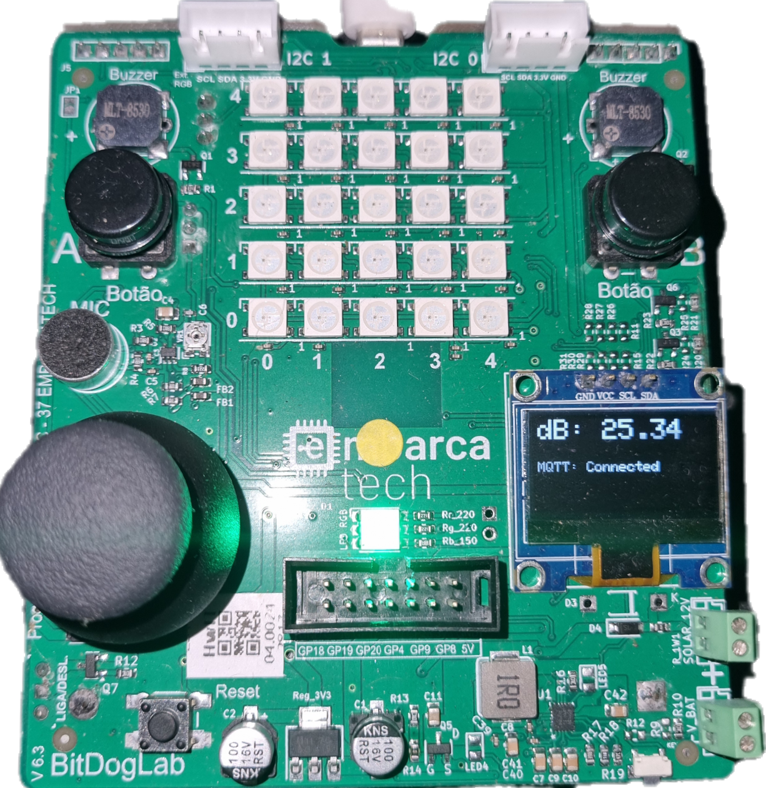

# SilentPico



This project (unnamed) offers a simple and innovative solution to automate the process of maintaining noise pollution using Rapberry Pi Pico W with BitDogLab Kit.

## Features

1. Noise detection
2. Digital-to-dB conversion
3. Media, max and min dB measurement
4. Wi-Fi and MQTT connectivity
5. Local mode if Wi-Fi connection fails
6. Auto Wi-Fi and MQTT reconnection
7. Store dB values on flash if connection fails

## Hardware Requirements

* Raspberry Pi Pico W
* SM7901TTL sensor (3.3V output)
* Oled Display (Optional) connected on GPIO 14 (SDA) 15 (SCL) (if you are not using Pico W with BITDOGLAB board)
* Button at GPIO 5 (Optional)

## Installation

Currently, SilentPico does not yet have the functionality to edit the wifi SSID/PASSWORD, MQTT topic/Broker IP Addres and other parameters, you will need to install a IDE to edit the code and compile, follow these steps:

### Windows:

1. Install GCC arm 13.3.Rel1
2. Install Pico SDK 1.5.1
3. Make sure you have it on your environment variables:
   
**On Path:**
```
C:\Program Files (x86)\Arm GNU Toolchain arm-none-eabi\13.3 rel1\bin
C:\Program Files\Raspberry Pi\Pico SDK v1.5.1\pico-sdk\toolchain\13.2 Rel1\bin
```
**On system variables:**
```
name: PICO_SDK_PATH

value: C:\Program Files\Raspberry Pi\Pico SDK v1.5.1

name: PICO_TOOLCHAIN_PATH

value: C:\Program Files\Raspberry Pi\Pico SDK v1.5.1\pico-sdk\toolchain
```
5. Install VS code
6. Install these VS code extensions: cmake/cmaketools, C/C++, Raspberry Pi.
7. import SilentPico Project on Raspberry Pi extension choosing Pico SDK Version 1.5.1
8. Change WIFI_SSID and WIFI_PASS on <inc/wifi.h> for your Wi-Fi ssid and password, change IP address and MQTT_TOPIC on <inc/mqtt.h> for your broker ip and topic.
9. Compile Project with Raspberry Pi extension
10. Install RP2040 drivers for Windows using zadig, choose 1 of the 2 interfaces and install a WinUSB driver (if you want see debug logs, install usbCDC on another interface).
11. Connect your Pico W on bootsel mode
12. Run project with Raspberry Pi extension

See that [tutorial](https://www.youtube.com/watch?v=cMtbuvkkF5c&t=194s) for more detailed steps.

## Usage

1. Libraries
   
2. Traffic noise measurement

4. Industry

5. Apartments

6. Another noise measurement you need in function of time

## TODO

The project is still under development, some upgrades are planned to be out very soon:

- [ ] Release .uf2 file
- [ ] DNS Resolve for broker ip
- [ ] Better way to edit Wi-Fi SSID and PASSWORD
- [x] Store JSONs on flash
- [x] Option to alternate Local and MQTT running mode
- [x] Wi-Fi and MQTT: auto reconnection

## Autors

* **jadielucas** (Jadiel Lucas)

## License

This project is licensed under the MIT License - see [LICENSE.md](https://github.com/jadielucas/IP_Project/blob/main/LICENSE) for more details.
